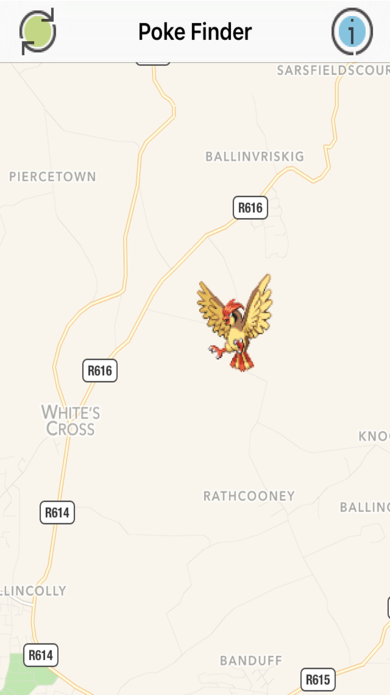

# PokeFinder Open Source iOS App

Allows PokemonGo players to add locations for Pokemon they have found!

# Core Concept
1. Add Pokemon you have seen to the map.
2. View Pokemon others have seen on the map.

# Broad Features
* Add sightings of various Pokemon on your travels playing PokemonGo.
* Set the Pokemons location, type & other info.
* View sigthings of Pokemon that have been submit by other players.
* Free, and with no ads!

# Core Features
* Maps

# Tags
pokemon, go, master, team, guide, yellow, red, blue, catch, chat, helper, level, coins, day, night

# Copyright
The name "PokemonGo" is a copyright of PokemonGo, Inc.

This project is in no way affiliated with, authorized, maintained, sponsored or endorsed by PokemonGo, Inc or any of its affiliates or subsidiaries.

I, the project owner and creator, am not responsible for any legalities that may arise in the use of this project. Use at your own risk.